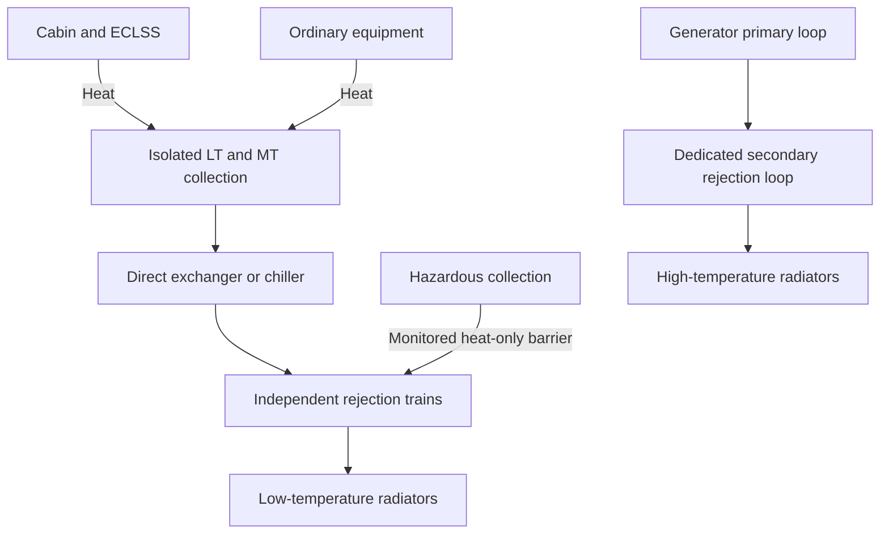

# Space Station Thermal Control — Design Specification

Version 1.0 — 4 October 2026

## 1. Purpose

Maintain crew spaces, equipment, stored resources, and structures within declared temperature limits. Collect heat from user-defined sectors, transport it through compatible isolated loops, and reject it to space. Provide heating where insulation and recovered heat are insufficient.

Integrate with environmental control and life support (ECLSS) and with electrical generation/distribution through explicit thermal, electrical, material, and control interfaces. Size capacity from sector demand and permitted cooling connectivity rather than assuming a fixed station size.

This is a conceptual design using approximate but dimensionally consistent engineering values. Operating temperatures, pressures, materials, and radiator performance require validation for the chosen orbit and hardware. Reliability guarantees apply to declared failures and durations.

## 2. Design requirements

1. Every admitted load shall have both adequate electrical power and an adequate thermal path.
2. A single pump, controller, power feed, heat exchanger, or declared distribution-segment failure shall not disable all cooling of a continuously critical load.
3. Full planned thermal demand shall remain supportable after loss of one radiator module or one cooling-production module within its service class. Loss of an entire rejection train shall preserve critical service; ordinary loads may be curtailed.
4. Normal, hazardous, generator-primary, and external coolant inventories shall remain physically segregated.
5. Coolant shall not be released routinely to reject heat. Consumptive emergency cooling, if provided, shall have a declared inventory and endurance.
6. Freeze protection and source shutdown cooling shall remain available during low-load operation, eclipses, and electrical failures.
7. The power controller shall receive cooling capacity and thermal-limit information before admitting new loads.
8. The system shall report unmet requirements when the allowed connectivity cannot provide the necessary temperature, flow, capacity, or redundancy.

## 3. User configuration

### 3.1 Sector thermal record

| Field | Unit | Meaning/default |
|---|---|---|
| Sector identifier | text | Unique sector name |
| Normal and peak heat | kW thermal | Required; inferred provisionally from electrical input if absent |
| Critical heat | kW thermal | Heat remaining from protected equipment and occupants |
| Heat profile | kW versus time | Normal, startup, shutdown, emergency, and maintenance cases |
| Coolant supply/return | °C | Required equipment interface or selected service class |
| Maximum interface temperature | °C | Maximum cold-plate/coolant/equipment temperature; distinguish each |
| Minimum temperature | °C | Freeze, chemistry, battery, or material limit |
| Coolant compatibility | material/fluid | Acceptable fluid, pressure, purity, and wetted materials |
| Peak duration | s | Sustained unless explicitly bounded |
| Allowed cooling interruption | s | Critical default: uninterrupted within temperature limits |
| Local buffer duration | min | Critical default: 10 min at critical heat |
| Permitted cooling connections | graph edges | Routes to service/rejection trains |
| Physical failure domain | text | Shared room, conduit, impact zone, or equipment bay |
| Occupancy and humidity load | people, kg H₂O/day | Cabin/ECLSS conditioning input |
| Heating requirement | kW | Worst cold-case demand |
| Effective thermal capacitance | kJ/K | Needed to claim temperature-rise endurance |

An electrical demand is not always equal to heat at that sector. Record heat exported by fluid streams, chemical energy storage, transmitted radiation, and shaft work crossing the boundary. Until those are known, conservatively allocate 100% of electrical input to local heat. Identify whether ECLSS heat and humidity loads are already included.

### 3.2 Cooling connection record

Declare endpoints, loop/service class, permitted coolant or heat-only transfer, route length, elevation where artificial gravity applies, pipe diameter or editable sizing, pressure limit, flow limit, heat-exchanger capacity, supply-temperature capability, isolation valves, and shared failure domains.

A cooling route is normally a supply-and-return pair. A single drawn edge represents both; a disconnected return makes the route unusable. A heat exchanger connects thermal networks but does not connect coolant inventories.

### 3.3 Initial sizing defaults

| Parameter | Default |
|---|---:|
| Future load growth | 20% |
| End-of-life/environment radiator derating | Included in declared radiator module rating |
| Internal water-like coolant heat capacity | 4.0 kJ/(kg·K) for first sizing |
| Internal coolant density | 1,000 kg/m³ for first sizing |
| Internal loop temperature rise | 8–10 K |
| Main loop differential pressure | 200 kPa initial estimate |
| Pump electrical efficiency | 60% overall |
| Heat-exchanger minimum terminal approach | 3 K initially; validate selected design |
| Exposed ordinary surfaces | At least 2 K above measured cabin dew point |
| Low-temperature chiller cooling COP | 4.0 preliminary |
| Critical powered cooling autonomy | Match power-system requirement; 8 h reference |
| Critical local thermal buffer | 10 min reference |

Apply growth once at the load boundary. Hardware rounding and failure reserve are separate. Pump/chiller heat is calculated explicitly; it shall not be hidden in a second overlapping percentage margin.

## 4. Loop architecture and temperature classes

Use sector-local collection loops, heat-exchanger interfaces, independent rejection trains, and modular radiators. Keep temperature classes distinct.

| Class | Example load | Initial collection temperature | Rejection method |
|---|---|---|---|
| LT: low temperature | Cabin dehumidification, selected refrigeration interfaces | 6°C supply / 14°C return | Chiller/heat pump to warmer sink |
| MT: moderate temperature | Batteries, ordinary electronics, selected process equipment | 18–22°C supply / 28–32°C return | Direct exchange where sink is sufficiently cold; otherwise chiller |
| WT: warm equipment | Compatible computing/process cold plates | 40°C supply / 50°C return | Direct exchange to cooler external loop or warm rejection train |
| HT: generation | Power-conversion heat and high-temperature machinery | Technology-specific; e.g. 250°C / 300°C secondary loop | Dedicated high-temperature radiator |
| Hazardous | Isolated laboratory air/equipment | Separate LT/MT/WT loops as required | Monitored heat-only barriers to dedicated or redundant sinks |

These are service proposals, not universal equipment limits. A battery rated for a lower temperature shall not be connected to a 40°C service merely because it reduces radiator area.

### 4.1 Heat-flow topology

The diagram summarizes services; critical paths shall be duplicated in the detailed equipment graph. There is no shared coolant manifold spanning all boxes.

### 4.2 Fluid choices and boundaries

Use treated water or a validated low-toxicity mixture inside occupied compartments. Coolant is not potable water or nutrient solution. Maintain separate servicing equipment and tanks.

External LT/MT coolant shall remain liquid over its actual temperature/pressure range; ammonia is a possible heritage-based option but is toxic and requires compatible materials and pressure control. A nominal 285–310 K single-phase ammonia design must be pressurized above the saturation pressure at its hottest credible condition, with cavitation margin. Glycol/water is not automatically freeze-proof under prolonged exposure to space.

HT coolant requires its own selection: high-temperature gases, qualified organic fluids, or liquid metals may be appropriate to the source. Do not extrapolate water-like fluid properties into HT sizing. Specify freeze point, vapor pressure, decomposition limit, viscosity, corrosion compatibility, and environmental release consequences.

Use monitored double-wall exchangers or an intermediate guard loop where a single barrier failure could introduce hazardous material into occupied coolant. This is a proposed higher-isolation architecture, not a claim that all existing spacecraft use double barriers.

## 5. ECLSS interfaces

### 5.1 Cabin temperature and humidity

ECLSS owns air circulation, atmospheric composition, humidity targets, condensate processing, and cabin air isolation. Thermal control supplies coolant at the agreed flow, temperature, and pressure, and accepts the resulting heat.

Initial cabin targets: 22°C nominal, 20–26°C ordinary operating range, 40–60% relative humidity. Emergency limits shall be supplied by the ECLSS design rather than inferred from coolant temperature alone.

Use two coil functions where practical:

- Sensible conditioning removes air heat without intended condensation.
- A condensing exchanger intentionally operates below dew point and has controlled condensate collection and microbial-management provisions.

At 22°C and 50% relative humidity, dew point is approximately 11°C; at 60% it is approximately 14°C. Use measured local dew point to control exposed pipes/cold plates. Insulate and vapor-seal LT pipes and valves. A nominal 18°C non-condensing supply can become inadequate if humidity rises substantially.

### 5.2 Condensation and agriculture

Approximate latent heat near cabin temperature: 2.45 MJ/kg water condensed.

`Q_latent_kW = water_kg_per_day × 2,450 / 86,400`

Examples:

- 150 kg/day human moisture: approximately 4.25 kW latent duty.
- 3,000 kg/day plant transpiration: approximately 85 kW latent duty.

These are exchanger duties, not automatically additional station energy inputs. Plant evaporation takes energy from its surroundings. If lighting and other electrical inputs already account for the whole greenhouse boundary, adding full transpiration latent heat again can double-count the same energy. Maintain sensible/latent routing within a conserved boundary energy balance.

Condensate crosses from ECLSS collection into its water-treatment system. No coolant crosses into that stream. In microgravity, condensate removal shall use capillary or actively separated collection; gravity drains alone are insufficient.

### 5.3 Process equipment

Electrolysis, water recovery, gas compression, sorbent regeneration, waste processing, and food/agriculture equipment shall supply device-specific heat profiles. For electrolysis, some input energy leaves stored in hydrogen and oxygen; use measured/vendor heat rather than assuming all input electricity is local heat if chemical energy is tracked explicitly.

Sorbent regeneration and sterilization can create short high-temperature loads. Connect them to compatible service classes, stage their cycles, or provide local buffers. Airlock atmosphere-recovery compressors also require declared pulse cooling loads.

### 5.4 Hazardous ECLSS

Hazardous-sector air, condensate, drains, and local coolant remain segregated. Transfer heat through two monitored barriers where contamination could otherwise cross. A pressure hierarchy alone is not a substitute for those barriers.

Provide redundant hazardous critical cooling paths, leak detection in guard spaces, isolated condensate collection, and independent emergency controls. A failed barrier causes isolation of that path and transfer to the healthy one. Return-to-service requires testing and hazard-specific clearance.

### 5.5 Waste-heat reuse

Recover appropriate heat for water preheating, greenhouse needs, or approved processes through isolated exchangers. Never make safe heat rejection depend on a consumer accepting recovered heat. The rejection system shall remain rated for zero heat-reuse credit unless the sink is explicitly guaranteed.

## 6. Power-generation and distribution interfaces

### 6.1 Energy accounting

For net electrical generation `P_net` and net conversion efficiency `eta_net`:

`Q_generation = P_net × (1 / eta_net − 1)`

At 2 MW net and 40% net efficiency: 5 MW thermal input, 3 MW generator heat, and 2 MW exported electricity. Generator-local losses and auxiliaries already included in the net-efficiency boundary shall not be counted again.

Electricity delivered to sectors generally later becomes additional low-temperature heat. Generator heat plus sector heat both require rejection, but at different temperatures. Electricity exported to a visiting craft or chemical energy accumulated is accounted for separately.

Battery charging adds losses and stored energy, not the entire charging input as immediate heat. On discharge, count battery and converter losses plus the heat generated by downstream loads. Do not add downstream load power twice.

### 6.2 Required power interface

Thermal control publishes available cooling by class and sector, temperature limits, permitted new load, time to overtemperature, and source derating requests. Power control publishes load schedules, generator output, battery charging/discharging, available critical power, trips, and restart plans.

A new high-power load is admitted only if both electrical and cooling capacity are available in the required fault scenario. A cooling shortfall can reduce generator output even when electrical ratings have spare capacity.

Thermal power requirements include pumps, fans within the agreed ownership boundary, chillers, heaters, radiator pointing, valves, sensors, controllers, and battery-backed auxiliaries. All critical cooling dependencies inherit the protected electrical priority of the equipment they support.

### 6.3 Startup and shutdown

Establish coolant flow and a qualified heat sink before starting a source. Verify temperature, pressure, flow, valve position, and reserve energy. During shutdown, continue required cooling after electrical output stops.

Nuclear decay-heat duty requires a source-specific time history, independent emergency heat removal, and mission-approved passive capability where feasible. Do not substitute an assumed fraction for a reactor safety analysis. A source that needs electrical pumps to produce power requires an independently supplied startup path; a source that cannot reject shutdown heat after blackout requires additional safeguards.

An emergency fuel cell also needs cooling. At approximately 50% electrical efficiency, heat is of the same order as its electrical output, with exact duty depending on product-water state and efficiency convention.

## 7. Thermal sizing procedure

### 7.1 Heat budgets

For each operating/failure case:

`Q_required = Q_sector + Q_environment_net + Q_thermal_auxiliaries − Q_guaranteed_exports`

Apply the growth allowance to the intended sector loads once. Calculate hull heat transfer, absorbed radiation, coolant pipe heat leaks, chemical storage changes, and exports at consistent boundaries. Use separate cold-case budgets for required heating.

A chiller with cooling COP `COP_c` obeys:

`P_chiller = Q_evaporator / COP_c`

`Q_condenser = Q_evaporator + P_chiller`

Thus 1 MW of cooling at COP 4 requires 250 kW electrical input and rejects 1.25 MW at the condenser, before ancillary pump heat.

COP shall vary with lift and part load in the final model. The reference COP 4 for 6–14°C coolant cooling and a warmer rejection sink is a preliminary assumption, not guaranteed hardware performance.

Iterate heat and electrical budgets: more cooling power raises generation and generator waste heat; update both plants until module counts stabilize and calculated auxiliary loads change by less than 1%.

### 7.2 Flow, pipes, and pumps

`mass_flow_kg_s = Q_kW / (cp_kJ_kgK × DeltaT_K)`

`volume_flow_m3_s = mass_flow / density`

`P_pump_W = pressure_drop_Pa × volume_flow_m3_s / efficiency`

For 1 MW, 4 kJ/(kg·K), and 10 K rise: 25 kg/s, or 0.025 m³/s. At 200 kPa and 60% efficiency: 8.33 kW pump input. A 2 m/s velocity target gives about 126 mm internal diameter for a single equivalent pipe. Actual branch sizes follow hydraulic analysis.

Calculate pressure drops from friction, valves, fittings, exchangers, and cold plates; 200 kPa is a starting estimate. Check pump cavitation margin, suction conditions, gas entrainment, pressure transients, and valve closure times.

### 7.3 Heat exchangers

`Q = UA × DeltaT_log_mean`

For 1 MW with 5 K logarithmic mean temperature difference, `UA = 200 kW/K`. With illustrative overall conductance 1 kW/(m²·K), exchange surface is about 200 m² within the exchanger. Double barriers and fouling can reduce conductance substantially.

Verify both terminal approach temperatures. A 300 K radiator cannot directly maintain a 279 K cold-water supply. It requires a colder sink or active refrigeration. Carry all exchanger approach losses through the complete path.

### 7.4 Radiators

At a consistent radiation boundary:

`Q_net = epsilon × sigma × A_effective × (T_emit⁴ − T_background⁴) − Q_absorbed`

`A_effective = Q_required / q_net_per_effective_area`

Use `sigma = 5.67 × 10^-8 W/(m²·K⁴)`. Model solar absorption, planetary infrared, albedo, view factors, mutual shadowing, orientation, degradation, and average panel temperature. Deep-space background is not an adequate environmental model for a radiator facing Earth.

| Mean emitting temperature | Ideal flux at emissivity 0.9 | Illustrative end-of-life design flux | Effective area per MW at design flux |
|---|---:|---:|---:|
| 300 K | 0.413 kW/m² | 0.300 kW/m² | 3,333 m² |
| 320 K | 0.535 kW/m² | 0.400 kW/m² | 2,500 m² |
| 500 K | 3.189 kW/m² | 2.400 kW/m² | 417 m² |

Design fluxes are assumptions for a suitably oriented/shaded reference installation, not universal orbital values. If both faces radiate effectively, emitting area can approach twice panel planform area; supports, piping, geometry, and obstructed views reduce that advantage. Report both emitting and planform areas.

### 7.5 Redundancy and connectivity

For equal modules of design heat capacity `Q_module`, choose count `n` so:

`(n − k) × Q_module ≥ Q_required_after_failure`

Apply this to chillers, heat exchangers, pumps at required head, and radiators within each service class. Ratings must refer to the same coolant temperatures and environmental case.

Then verify every heat path with failed components removed. A graph can screen disconnected routes, but hydraulic balance and temperature feasibility are also required. A spare radiator on an inaccessible loop does not provide useful redundancy.

## 8. Equipment and coolant inventories

Every loop includes pumps with independently powered drives, isolation/check valves, pressure/temperature/flow sensors, filters, fill/drain ports, gas separation, expansion accommodation, pressure relief into appropriate capture, and replaceable hardware.

In microgravity, use positive-expulsion accumulators and controlled gas separation; do not rely on an open gravity header tank. Maintain pump suction supply through all attitudes.

Derive coolant volume from pipe internal volume plus exchanger, radiator, equipment, and accumulator volumes:

`V_pipe = pi × D_internal² / 4 × total_pipe_length`

For 100 m of 0.126 m internal-diameter piping, volume is approximately 1.25 m³; a 100 m supply plus 100 m return contains approximately 2.5 m³.

Initial servicing provision: spare compatible coolant equal to the largest isolatable section inventory plus 10% of connected operating inventory. Size expansion volume from fluid expansion across temperature limits plus gas/pressure-control requirements; 10% of operating volume is only a provisional allowance.

Make inventories loop-specific. Hazard coolant reserve shall not be shared with normal coolant. Provide captured liquid from internal leaks; exposed leaks require section isolation and declared loss allowance. Expansion tanks are not routine waste tanks.

## 9. Thermal buffers and emergency endurance

For heat mismatch over a finite period:

`E_buffer = integral(Q_load − Q_available_rejection) dt`

Water-like sensible storage:

`mass_kg = E_kJ / (cp_kJ_kgK × allowed_temperature_rise_K)`

100 kW for 10 min is 60 MJ. With a 10 K allowed rise and `cp = 4 kJ/(kg·K)`, about 1,500 kg or 1.5 m³ coolant storage is required before unusable inventory and exchanger margins. The allowed rise shall actually fit the load's temperature limits.

A nominal phase-change material with latent capacity 200 kJ/kg requires 300 kg active material for the same 60 MJ, excluding containment and thermal-transfer limitations. Its melt temperature shall remain below the protected interface maximum after thermal resistances.

Local thermal buffers do not replace coolant circulation unless passive conduction/heat pipes can access them. A 10 min buffer is transfer grace, not 8 h cooling autonomy. At 100 kW, eight hours would require 2.88 GJ, equivalent to about 72 tonnes of water-like storage over 10 K.

Provide ongoing critical radiator cooling with protected electrical power. For 120 kW electrical cooling auxiliaries over eight hours, delivered energy is 960 kWh. If dedicated storage uses 80% end-of-life capacity, 70% usable window, and 95% output efficiency, nameplate requirement is about 1.81 MWh before redundancy. This may be allocated within the main power-system reserve rather than added twice.

Optional expendable cooling shall declare working-fluid mass, latent capacity, vent direction, freezing/contamination controls, and endurance. It shall not be treated as indefinitely sustainable.

## 10. Reference numerical installation

This illustrative installation extends the existing modular power concept. It is a separate operating scenario, not a revalidation of its previous peak-load calculation. New chiller electricity shall trigger power-system resizing.

### 10.1 Thermal loads

| Service boundary | Initial peak thermal demand | After 20% sector growth |
|---|---:|---:|
| LT cabin/ECLSS conditioning | 1.0 MW | 1.2 MW |
| MT/WT equipment, including battery/converter cooling | 2.0 MW | 2.4 MW |
| **Collected station demand** | **3.0 MW** | **3.6 MW** |

For this example, the equipment group is qualified for WT service at 40°C supply / 50°C return, with direct heat transfer to an external circuit operating approximately 290–310 K through adequate exchanger approaches. Equipment requiring the MT service temperatures moves to chilled service and changes the budget. The equipment group therefore does not imply that all batteries or ordinary electronics can accept WT coolant. All hazardous-sector heat is included in these totals through isolated interfaces. Generator heat is separate.

The LT chiller rejects to a warmer 310–325 K condenser loop with mean emitting radiator temperature about 320 K. Normal direct-rejection radiators have an illustrative 300 K mean emitting temperature. These two external fluid circuits are separate even when mounted on the same structural wing.

LT chiller at COP 4:

- Cold-side duty: 1.2 MW.
- Compressor input: 0.30 MW.
- Condenser duty: 1.50 MW.

Allocate preliminary thermal-control auxiliary power of 0.12 MW excluding compressors: 0.08 MW becomes heat in direct rejection and 0.04 MW in warm rejection. This provisional allocation must be replaced by component calculations and already includes ordinary thermal-control pumps/controllers. Any additional cold-side heat or HT auxiliary not inside generator net efficiency requires revision.

Therefore:

- Direct rejection duty: `2.4 + 0.08 = 2.48 MW`.
- Warm condenser rejection duty: `1.50 + 0.04 = 1.54 MW`.
- Total low-temperature rejection: `4.02 MW`.
- Thermal-control electrical demand: `0.30 + 0.12 = 0.42 MW`.

No latent-water duty is added to these totals again; it is part of the declared ECLSS conditioning boundary.

### 10.2 Chillers and station rejection trains

Select three 0.6 MW cold-side chiller modules with independent controls and isolation. Two remaining modules supply 1.2 MW after loss of one. Place the modules on physically separated branches; verify critical service after a larger failure-domain event.

Provide independent rejection trains A and B. Each supports:

- Three 0.60 MW direct-rejection modules: six total, 3.60 MW installed.
- Three 0.40 MW warm-rejection modules: six total, 2.40 MW installed.

After one module loss anywhere in its class:

- Direct capacity: 3.00 MW, exceeding 2.48 MW.
- Warm capacity: 2.00 MW, exceeding 1.54 MW.

After loss of one entire train:

- Direct capacity: 1.80 MW.
- Warm capacity: 1.20 MW.

Thus an entire train loss requires curtailing ordinary loads. It does not preserve the full 4.02 MW operating case. For an illustrative critical-only case with direct duty 0.35 MW and warm duty 0.225 MW, either train has ample steady-state capacity, subject to surviving paths and power.

Total effective emitting area:

- Direct: `3.60 MW / 0.000300 MW/m² = 12,000 m²`.
- Warm: `2.40 MW / 0.000400 MW/m² = 6,000 m²`.
- Combined station rejection: 18,000 m² effective emitting area.

Critical cold-side duty assumed here is 0.15 MW; at COP 4 it adds 0.0375 MW compressor power and 0.1875 MW condenser heat. The 0.225 MW critical warm duty includes 0.0375 MW other heat. Critical auxiliary electricity is provisionally 0.12 MW excluding the compressor, giving 0.1575 MW protected thermal-control power. Replace the earlier generic 120 kW storage example with this actual figure when sizing this installation.

### 10.3 Generator rejection

Four 2 MW net thermal generation modules at 40% net efficiency each require 3 MW rejection at full output. Give each source four independently isolatable 1.2 MW HT radiator sections, 4.8 MW per source installed. One section unavailable leaves 3.6 MW, exceeding its 3 MW duty with 20% remaining margin.

For four sources, installed HT capacity is 19.2 MW. At 2.4 kW/m² design flux, effective emitting area is 8,000 m² total. This is more redundant than the power specification's earlier 14.4 MW generator radiator allowance. Loss of a whole source rejection loop removes its generator; the electrical plant must tolerate that generator outage.

Shutdown heat-removal equipment is additional unless the source design explicitly credits surviving HT sections and passive paths.

### 10.4 Combined requirement

| Item | Reference value |
|---|---:|
| Station heat collected after growth | 3.6 MW |
| Low-temperature heat rejected including auxiliaries | 4.02 MW |
| Thermal-control electrical demand | 0.42 MW |
| Station radiator installed capacity across two classes | 6.0 MW |
| Station effective emitting area | 18,000 m² |
| Full-output generator waste heat | 12 MW |
| Installed HT radiator capacity | 19.2 MW |
| HT effective emitting area | 8,000 m² |
| **Total effective emitting area** | **26,000 m²** |

The areas are large because megawatts of relatively cool heat require large radiators. Planform area is geometry-dependent. The example exposes that cost rather than assuming a compact radiator can reject arbitrary power.

The previous electrical plant's 5.4 MW firm output had little peak-plus-recharge margin. If the 0.42 MW thermal demand is additional to that budget, retaining its prior load case requires more generation, reduced simultaneous loads, or revised recharge scheduling. Some prior auxiliaries may already overlap; reconcile the component register before adding the complete amount.

## 11. Fault management and operational states

| Event/state | Required response |
|---|---|
| Normal | Balance temperatures and flow; maintain critical reserves |
| Pump trip | Start independent standby; buffer transient; shed ordinary loads if temperature margin is insufficient |
| External leak | Isolate both ends of the affected branch; stop backfeed; preserve surviving coolant inventory |
| Internal leak | Isolate and capture coolant; protect electrics and crew; transfer critical cooling |
| Hazard barrier leak | Isolate failed thermal interface; retain containment and healthy heat-only path |
| Radiator loss or poor orientation | Recompute class-specific capacity; inhibit load starts and derate affected sources |
| Chiller failure | Transfer to remaining modules; preserve low-temperature critical loads first |
| Low heat load/cold orbit case | Bypass radiator flow, modulate rejection, and use freeze-protection heating |
| Electrical blackout | Continue protected cooling, shut down ordinary heat sources, maintain source shutdown cooling |
| Network/controller failure | Local temperature/pressure protections operate independently |
| Recovery | Restore cooling before load restart; recharge thermal buffers without overwhelming rejection |

Detect faults using inlet/outlet temperature, flow, pressure, inventory, pump current, valve position, and barrier-space sensors. Use multiple independent temperature sensors for protective trips. Sensor disagreement shall trigger a defined conservative response rather than accepting one implausible measurement.

Valves have function-specific fail states: leak isolation tends toward closed; necessary critical circulation/bypass paths tend toward maintained safe flow. There is no universal fail-closed setting for all thermal valves. Critical isolation requires stored actuation energy or another verified mechanism.

Set equipment-specific warning, derating, and trip limits with margins for sensor error, thermal lag, and local gradients. A 2 K warning margin may be a provisional starting point but shall not replace validated transient analysis.

## 12. Passive protection and special interfaces

Use multilayer insulation, controlled-emissivity coatings, thermal breaks, heat straps, heat pipes, and shade geometry to reduce active demand. Limit thermal bridges through docking structures, pipe penetrations, and equipment mounts. Evaluate thermal expansion, gradients, and fatigue across structural interfaces.

Airlocks need intermittent equipment/air conditioning and freeze protection during depressurization; convection disappears in vacuum, so exposed electronics need conduction/radiation paths. Suit thermal servicing remains an isolated interface, not a direct coolant connection by default.

Docked craft receive cooling only through a qualified interface with declared flow, heat duty, fluids, pressures, and isolation. Prefer heat-only transfer where foreign coolant compatibility is uncertain. Emergency disconnect shall not drain station loops.

Radiator pointing shall coordinate with attitude control, solar arrays, communications sightlines, exhaust plumes, and visiting vehicles. Radiators shall not obstruct required escape or docking corridors. External gas/liquid releases can contaminate radiator surfaces; include them in layout constraints.

## 13. Simulation and control model

For each lumped thermal node:

`C_eff × dT/dt = Q_generated + Q_received − Q_removed`

Use kJ/K, kW, and seconds consistently. Include coolant transit time, component-to-coolant resistance, radiator temperature distribution, phase-change state, pump curves, valve positions, and source shutdown heat histories.

Track electrical energy, coolant mass, stored thermal energy, emitted heat, absorbed radiation, and chemical/other exports. Enforce an energy-balance residual tolerance agreed for the model; a 1% steady-state residual is an initial numerical target.

The controller shall forecast time to each temperature limit, not only current temperature. Admit scheduled loads against the worse of current capacity and required failure-case capacity. Coordinate shedding using the user-defined critical register; hazardous containment and source shutdown cooling shall not be lost merely because their associated experiment/generator output is stopped.

## 14. Acceptance and required outputs

Deliver a sector heat register, temperature-class assignments, coolant inventories, supply/return graph, exchanger schedule, pump/pipe calculations, radiator layout and areas, electrical auxiliary schedule, and interface-control records for ECLSS and power.

Verify:

- Normal and peak duty under the worst hot environmental case.
- Minimum load under the worst cold case without freezing or excessive heater demand.
- Every declared single equipment/segment failure and critical service after one rejection-train loss.
- Largest heat-source step and pump/chiller transfer against actual temperature limits.
- Loss of primary generation for the declared electrical autonomy, including shutdown cooling.
- Hazard barrier failure without contamination of normal fluid networks.
- Black start without circular dependence between generation and cooling.
- Repeated emergency events with buffers partly discharged and tanks at minimum inventory.
- Sector expansion with updated power demand, heat budget, routing, and radiator view factors.

Report infeasible paths and required changes explicitly. Thermal continuity is demonstrated at the protected equipment interface, not merely by showing that a pump remains powered.

## 15. Technical references and assumptions

The architecture draws on spacecraft practice: NASA describes ISS external ammonia loops cooling internal water loops and rejecting heat through radiators. NASA's thermal-control overview describes passive and active approaches and their dependence on thermal environment.

- [NASA NTRS — ISS Active Thermal Control Pump Performance and Reliability](https://ntrs.nasa.gov/citations/20110023292)
- [NASA — State of the Art: Thermal Control](https://www.nasa.gov/smallsat-institute/sst-soa/thermal-control/)
- [NASA NTRS — Strategies to Mitigate Ammonia Release on the ISS](https://ntrs.nasa.gov/citations/20070018136)
- [NASA NTRS — Thermal Radiator Pointing for the ISS](https://ntrs.nasa.gov/citations/20000032541)

All numerical loads, module selections, margins, and design fluxes are proposed reference assumptions. These sources support engineering context, not qualification of the reference megawatt installation. The existing sector power specification is an integration input; its generator capacities and protected-load definitions shall be recalculated when thermal-control demands are finalized.
